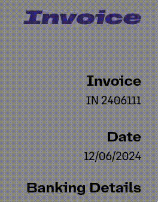

# Invoice Generator

## Features

Editable information

- Banking Details
- Company and Client Addresses

Invoice Number

- Naming Convention - {Current date (yyMMdd) }{Sale Number}
- Increment sale number
  (buttons hidden under Invoice Number so they don't get printed)
- Autopopulates payment ref

## To do

Make Products editable

- Currently reads a hardcoded list
- Autosums product prices

## npm scripts

## Build and dev scripts

- `dev` – start development server
- `build` – build production version of the app
- `preview` – locally preview production build

### Testing scripts

- `typecheck` – checks TypeScript types
- `lint` – runs ESLint
- `prettier:check` – checks files with Prettier
- `vitest` – runs vitest tests
- `vitest:watch` – starts vitest watch
- `test` – runs `vitest`, `prettier:check`, `lint` and `typecheck` scripts
